# Breadboard: orchestrator-solid-refactor

## Places

| # | Place | Description |
|---|-------|-------------|
| P1 | HTTP Layer | Controllers + Routes. Entry point for requests. Thin, unchanged. |
| P2 | Chain Handler | `OrchestratorChainHandler`. Routes content type to orchestrator adapter. Unchanged interface. |
| P3 | Pipeline Adapter | NEW `PipelineEditorialOrchestrator`. Bridge between chain and pipeline. Applies visibility strategy. |
| P4 | Enrichment Pipeline | `EnrichmentPipeline`. Executes enrichers in priority order with graceful degradation. |
| P5 | Enrichers | Individual `EnricherInterface` implementations. Each fetches one concern via its gateway. |
| P6 | Gateway Layer | `*GatewayInterface` abstractions over HTTP clients. Port/Adapter boundary. |
| P7 | Response Assembly | `*ResponseFactory` classes. Transform enriched `EditorialContext` into JSON-compatible array. |
| P8 | External Services | Downstream microservices (editorial-api, section-api, multimedia-api, tag-api, journalist-api, membership-api, legacy-api). |

---

## Code Affordances

| # | Place | Component | Affordance | Control | Wires Out | Returns To |
|---|-------|-----------|-----------|---------|-----------|-----------|
| N1 | P1 | EditorialController | `getEditorialById(Request, id)` | HTTP GET /editorials/{id} | N3 | HTTP Response |
| N2 | P1 | PreviumEditorialController | `getEditorialById(Request, id)` | HTTP GET /previum/{id} | N3 | HTTP Response |
| N3 | P2 | OrchestratorChainHandler | `handler(contentType, Request)` | Method call | N4 or N5 | N1 or N2 |
| N4 | P3 | PipelineEditorialOrchestrator(editorial) | `execute(Request): array` with PublishedOnlyStrategy | Method call | N7, N8, N9 | N3 |
| N5 | P3 | PipelineEditorialOrchestrator(previum) | `execute(Request): array` with AllowAllStrategy | Method call | N7, N8, N9 | N3 |
| N6 | P3 | VisibilityStrategyInterface | `checkVisibility(NewsBase): void` | Method call | | N4, N5 |
| N7 | P4 | EnrichmentPipeline | `process(EditorialContext): EditorialContext` | Pipeline orchestration | N10-N20 | N4, N5 |
| N8 | P3 | EditorialResponseFactory | `create(EditorialContext): array` | Method call | N21-N26 | N4, N5 |
| N9 | P3 | VisibilityStrategy dispatch | Check visibility after editorial is fetched | Inline in adapter | N6 | N4, N5 |
| N10 | P5 | EditorialEnricher | `enrich(context)` - Fetch editorial by ID | Priority 100 | N27 | S1 |
| N11 | P5 | SectionEnricher | `enrich(context)` - Fetch section | Priority 90 | N28 | S1 |
| N12 | P5 | MultimediaEnricher | `enrich(context)` - Fetch main multimedia | Priority 80 | N29 | S1 |
| N13 | P5 | OpeningMultimediaEnricher (NEW) | `enrich(context)` - Fetch opening multimedia | Priority 75 | N29, N30 | S1 |
| N14 | P5 | TagsEnricher | `enrich(context)` - Fetch tags | Priority 70 | N31 | S1 |
| N15 | P5 | JournalistsEnricher | `enrich(context)` - Resolve signatures | Priority 60 | N32 | S1 |
| N16 | P5 | MembershipEnricher | `enrich(context)` - Resolve membership links | Priority 50 | N33 | S1 |
| N17 | P5 | CommentsEnricher | `enrich(context)` - Fetch comment count | Priority 40 | N34 | S1 |
| N18 | P5 | BodyPhotosEnricher (NEW) | `enrich(context)` - Extract + fetch body photos | Priority 35 | N29 | S1 |
| N19 | P5 | InsertedNewsEnricher (NEW) | `enrich(context)` - Fetch sub-editorial data | Priority 30 | N27, N28, N32, N29 | S1 |
| N20 | P5 | RecommendedEditorialsEnricher (NEW) | `enrich(context)` - Fetch recommended editorial data | Priority 25 | N27, N28, N32, N29 | S1 |
| N21 | P7 | TitlesResponseFactory | `create(NewsBase): array` | Factory | | N8 |
| N22 | P7 | SectionResponseFactory | `create(Section): array` | Factory | | N8 |
| N23 | P7 | TagResponseFactory | `create(Tag[]): array` | Factory | | N8 |
| N24 | P7 | SignatureResponseFactory | `create(Journalist[]): array` | Factory | | N8 |
| N25 | P7 | BodyResponseFactory | `create(Body, resolveData): array` | Factory | | N8 |
| N26 | P7 | MultimediaResponseFactory | `create(Multimedia): array` | Factory | | N8 |
| N27 | P6 | EditorialGatewayInterface | `findById(id): ?NewsBase` | Gateway | P8 | N10, N19, N20 |
| N28 | P6 | SectionGatewayInterface | `findById(id): ?Section` | Gateway | P8 | N11, N19, N20 |
| N29 | P6 | MultimediaGatewayInterface | `findById(id)`, `findPhotoById(id)` | Gateway | P8 | N12, N13, N18, N19, N20 |
| N30 | P6 | MultimediaOrchestratorHandler | `handler(Multimedia): array` | Sub-chain | P8 | N13 |
| N31 | P6 | TagGatewayInterface | `findByIds(ids): Tag[]` | Gateway | P8 | N14 |
| N32 | P6 | JournalistGatewayInterface | `findByAliasId(id): ?Journalist` | Gateway | P8 | N15, N19, N20 |
| N33 | P6 | MembershipGatewayInterface | `getMembershipUrls(body, siteId): array` | Gateway | P8 | N16 |
| N34 | P6 | CommentGatewayInterface (NEW) | `findCommentCount(id): int` | Gateway | P8 | N17 |

---

## Data Stores

| # | Place | Store | Description |
|---|-------|-------|-------------|
| S1 | P4 | EditorialContext | Pipeline DTO that accumulates data from all enrichers. Type-safe getters/setters for editorial, section, tags, journalists, multimedia, membershipLinks, bodyPhotos, insertedNews, recommendedEditorials, commentsCount, multimediaOpening. |
| S2 | P2 | Orchestrator Registry | In-memory map `[contentType => EditorialOrchestratorInterface]` in OrchestratorChainHandler. |
| S3 | P8 | External APIs | Downstream microservice state (editorial DB, section DB, multimedia storage, etc.) |

---

## Breadboard Diagram

```mermaid
flowchart TB
    subgraph P1["P1: HTTP Layer"]
        N1["N1: EditorialController<br/>/editorials/{id}"]:::code
        N2["N2: PreviumController<br/>/previum/{id}"]:::code
    end

    subgraph P2["P2: Chain Handler"]
        N3["N3: OrchestratorChainHandler<br/>handler(type, request)"]:::code
        S2[("S2: Orchestrator Registry")]:::store
    end

    subgraph P3["P3: Pipeline Adapter"]
        N4["N4: Adapter(editorial)<br/>PublishedOnlyStrategy"]:::code
        N5["N5: Adapter(previum)<br/>AllowAllStrategy"]:::code
        N6["N6: VisibilityStrategy<br/>checkVisibility()"]:::code
        N8["N8: ResponseFactory<br/>create(context)"]:::code
    end

    subgraph P4["P4: Enrichment Pipeline"]
        N7["N7: EnrichmentPipeline<br/>process(context)"]:::code
        S1[("S1: EditorialContext")]:::store
    end

    subgraph P5["P5: Enrichers"]
        N10["N10: EditorialEnricher (100)"]:::code
        N11["N11: SectionEnricher (90)"]:::code
        N12["N12: MultimediaEnricher (80)"]:::code
        N13["N13: OpeningMM Enricher (75)"]:::newcode
        N14["N14: TagsEnricher (70)"]:::code
        N15["N15: JournalistsEnricher (60)"]:::code
        N16["N16: MembershipEnricher (50)"]:::code
        N17["N17: CommentsEnricher (40)"]:::code
        N18["N18: BodyPhotos Enricher (35)"]:::newcode
        N19["N19: InsertedNews Enricher (30)"]:::newcode
        N20["N20: RecommendedEd Enricher (25)"]:::newcode
    end

    subgraph P6["P6: Gateway Layer"]
        N27["N27: EditorialGateway"]:::code
        N28["N28: SectionGateway"]:::code
        N29["N29: MultimediaGateway"]:::code
        N31["N31: TagGateway"]:::code
        N32["N32: JournalistGateway"]:::code
        N33["N33: MembershipGateway"]:::code
        N34["N34: CommentGateway"]:::newcode
    end

    subgraph P7["P7: Response Assembly"]
        N21["N21: TitlesFactory"]:::code
        N22["N22: SectionFactory"]:::code
        N23["N23: TagFactory"]:::code
        N24["N24: SignatureFactory"]:::code
        N25["N25: BodyFactory"]:::code
        N26["N26: MultimediaFactory"]:::code
    end

    subgraph P8["P8: External Services"]
        EXT["Microservices<br/>(editorial, section, mm, tag, journalist, membership, legacy)"]:::external
    end

    N1 --> N3
    N2 --> N3
    S2 -.-> N3
    N3 --> N4
    N3 --> N5
    N4 --> N6
    N5 --> N6
    N4 --> N7
    N5 --> N7
    N7 --> N10 & N11 & N12 & N13 & N14 & N15 & N16 & N17 & N18 & N19 & N20
    N10 & N11 & N12 & N13 & N14 & N15 & N16 & N17 & N18 & N19 & N20 -.-> S1
    N10 --> N27
    N11 --> N28
    N12 --> N29
    N13 --> N29
    N14 --> N31
    N15 --> N32
    N16 --> N33
    N17 --> N34
    N18 --> N29
    N19 --> N27 & N28 & N32 & N29
    N20 --> N27 & N28 & N32 & N29
    N27 & N28 & N29 & N31 & N32 & N33 & N34 --> EXT
    S1 -.-> N8
    N4 -.-> N8
    N5 -.-> N8
    N8 --> N21 & N22 & N23 & N24 & N25 & N26

    classDef code fill:#d3d3d3,stroke:#333
    classDef newcode fill:#90EE90,stroke:#333
    classDef store fill:#e6e6fa,stroke:#333
    classDef external fill:#FFB6C1,stroke:#333
```

**Legend**: Grey = existing code, Green = new code to create, Lavender = data stores, Pink = external
