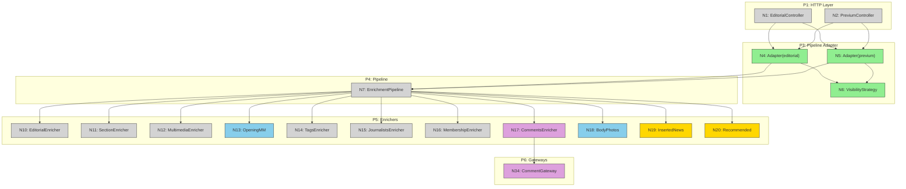

# Slices: orchestrator-solid-refactor

## Summary

| Slice | Description | Affordances | Demo |
|-------|-------------|-------------|------|
| V1 | Pipeline Adapter + Visibility Strategy | N4, N5, N6, N8, N9 | GET /editorials/{id} returns editorial via pipeline (core enrichers). GET /previum/{id} returns unpublished editorial. Same JSON output. |
| V2 | Missing Enrichers: Opening Multimedia + Body Photos | N13, N18 | GET /editorials/{id} returns complete multimedia opening and body photos. |
| V3 | Missing Enrichers: Inserted News + Recommended | N19, N20 | GET /editorials/{id} returns inserted news and recommended editorials data. Full parity with legacy. |
| V4 | Gateway Cleanup + CommentGateway | N34 | CommentsEnricher uses CommentGatewayInterface instead of concrete QueryLegacyClient. All DIP violations resolved. |
| V5 | Legacy Removal + Test Parity | N/A (removal) | Legacy orchestrators removed. All tests green. JSON output identical to legacy. |

---

## V1: Pipeline Adapter + Visibility Strategy

**Demo**: Call `GET /editorials/{id}` with a published editorial. Get same JSON response as before but served through the pipeline. Call `GET /previum/{id}` with an unpublished editorial. Get the editorial content (no 404). Both routes use the SAME pipeline code, differentiated only by VisibilityStrategy.

### New Code

| # | Place | Affordance | Type | File |
|---|-------|-----------|------|------|
| N4 | P3 | PipelineEditorialOrchestrator(editorial) | Code | `src/Orchestrator/Chain/PipelineEditorialOrchestrator.php` |
| N5 | P3 | PipelineEditorialOrchestrator(previum) | Code | Same class, different service config |
| N6 | P3 | VisibilityStrategyInterface | Code | `src/Application/Strategy/Visibility/VisibilityStrategyInterface.php` |
| N6a | P3 | PublishedOnlyStrategy | Code | `src/Application/Strategy/Visibility/PublishedOnlyStrategy.php` |
| N6b | P3 | AllowAllStrategy | Code | `src/Application/Strategy/Visibility/AllowAllStrategy.php` |
| N8 | P7 | EditorialResponseFactory integration | Code | Wire existing factory into adapter |
| N9 | P3 | Visibility dispatch in adapter | Code | Part of PipelineEditorialOrchestrator |

### Config Changes

| File | Change |
|------|--------|
| `config/packages/orchestrators.yaml` | Register two PipelineEditorialOrchestrator instances with different strategies |
| `config/services/pipeline.yaml` | Wire strategy services |

### Existing Code Used (no changes)

| # | Component | Notes |
|---|-----------|-------|
| N7 | EnrichmentPipeline | Already works |
| N10 | EditorialEnricher | Already fetches editorial |
| N11 | SectionEnricher | Already fetches section |
| N12 | MultimediaEnricher | Already fetches main multimedia |
| N14 | TagsEnricher | Already fetches tags |
| N15 | JournalistsEnricher | Already resolves journalists |
| N16 | MembershipEnricher | Already resolves membership |
| N17 | CommentsEnricher | Already fetches comments |
| S1 | EditorialContext | Already accumulates data |
| N21-N26 | Response Factories | Already transform to JSON |

### Tests

- `PipelineEditorialOrchestratorTest` - Test with PublishedOnlyStrategy (throws on unpublished) and AllowAllStrategy (allows all)
- `PublishedOnlyStrategyTest` - Unit test
- `AllowAllStrategyTest` - Unit test
- Integration/smoke test: verify JSON output parity with legacy for a published editorial

### Acceptance Criteria

- [ ] `GET /editorials/{id}` returns 200 with JSON matching legacy output (for fields covered by existing enrichers)
- [ ] `GET /editorials/{id}` returns 404 for unpublished editorials
- [ ] `GET /previum/{id}` returns 200 for unpublished editorials
- [ ] Legacy `EditorialOrchestrator` and `PreviumEditorialOrchestrator` still exist but are no longer wired in orchestrators.yaml
- [ ] Pipeline adapter implements `EditorialOrchestratorInterface`

---

## V2: Missing Enrichers - Opening Multimedia + Body Photos

**Demo**: Call `GET /editorials/{id}` for an editorial with opening multimedia and body photos. The response now includes complete `multimedia` opening data and `photoFromBodyTags` exactly matching the legacy output.

### New Code

| # | Place | Affordance | Type | File |
|---|-------|-----------|------|------|
| N13 | P5 | OpeningMultimediaEnricher | Code | `src/Application/Pipeline/Enricher/OpeningMultimediaEnricher.php` |
| N18 | P5 | BodyPhotosEnricher | Code | `src/Application/Pipeline/Enricher/BodyPhotosEnricher.php` |

### Gateway Changes

| Interface | Change |
|-----------|--------|
| `MultimediaGatewayInterface` | Add `findOpeningMultimediaById(string $id): ?Multimedia` method |
| `MultimediaHttpGateway` | Implement using existing `QueryMultimediaOpeningClient` |

### Tests

- `OpeningMultimediaEnricherTest` - Fetch opening, handle missing opening, handle fetch errors
- `BodyPhotosEnricherTest` - Extract photo IDs from body, fetch each, handle missing photos

### Acceptance Criteria

- [ ] OpeningMultimediaEnricher populates `context->multimediaOpening()` correctly
- [ ] BodyPhotosEnricher populates `context->bodyPhotos()` correctly
- [ ] JSON output for multimedia and body photos matches legacy exactly
- [ ] Enrichers handle errors gracefully (log + continue)

---

## V3: Missing Enrichers - Inserted News + Recommended Editorials

**Demo**: Call `GET /editorials/{id}` for an editorial with inserted news and recommended editorials. The response includes fully enriched sub-editorial data for both, matching legacy output. This achieves **full parity** with the legacy orchestrator.

### New Code

| # | Place | Affordance | Type | File |
|---|-------|-----------|------|------|
| N19 | P5 | InsertedNewsEnricher | Code | `src/Application/Pipeline/Enricher/InsertedNewsEnricher.php` |
| N20 | P5 | RecommendedEditorialsEnricher | Code | `src/Application/Pipeline/Enricher/RecommendedEditorialsEnricher.php` |

### Response Factory Changes

| Factory | Change |
|---------|--------|
| `RecommendedEditorialResponseFactory` (NEW) | Create factory for transforming recommended editorial data |
| `EditorialResponseFactory` | Update to use RecommendedEditorialResponseFactory for recommended editorials |

### Tests

- `InsertedNewsEnricherTest` - Multiple inserted news, visibility filtering, gateway errors
- `RecommendedEditorialsEnricherTest` - Multiple recommended, visibility filtering, gateway errors
- `RecommendedEditorialResponseFactoryTest` - Output format

### Acceptance Criteria

- [ ] InsertedNewsEnricher populates `context->insertedNews()` with complete sub-editorial data
- [ ] RecommendedEditorialsEnricher populates `context->recommendedEditorials()` with complete data
- [ ] Both enrichers respect visibility (skip non-visible sub-editorials)
- [ ] Full JSON output parity with legacy for ALL fields
- [ ] RecommendedEditorialResponseFactory produces same format as legacy `RecommendedEditorialsDataTransformer`

---

## V4: Gateway Cleanup + CommentGateway

**Demo**: All enrichers depend on gateway interfaces (abstractions), not concrete HTTP clients. `CommentsEnricher` now uses `CommentGatewayInterface` instead of `QueryLegacyClient` directly. DIP fully compliant.

### New Code

| # | Place | Affordance | Type | File |
|---|-------|-----------|------|------|
| N34 | P6 | CommentGatewayInterface | Code | `src/Domain/Port/Gateway/CommentGatewayInterface.php` |
| N34a | P6 | CommentHttpGateway | Code | `src/Infrastructure/Gateway/Http/CommentHttpGateway.php` |

### Changes to Existing Code

| File | Change |
|------|--------|
| `CommentsEnricher` | Replace `QueryLegacyClient` dependency with `CommentGatewayInterface` |
| `config/services/pipeline.yaml` | Register `CommentGatewayInterface` alias |

### Tests

- `CommentHttpGatewayTest` - Wraps QueryLegacyClient correctly
- Update `CommentsEnricherTest` - Now mocks CommentGatewayInterface

### Acceptance Criteria

- [ ] `CommentsEnricher` depends on `CommentGatewayInterface` (not concrete client)
- [ ] No enricher directly depends on any concrete client class
- [ ] Legacy fallback in `EditorialHttpGateway::findById()` handles sourceEditorial transparently
- [ ] All gateway HTTP implementations are tested

---

## V5: Legacy Removal + Test Parity

**Demo**: `EditorialOrchestrator.php` and `PreviumEditorialOrchestrator.php` are deleted. All tests pass. `EditorialOrchestratorLegacy.php` (deprecation notice) remains as documentation. JSON output is byte-identical to legacy for a comprehensive test suite of editorial types.

### Removals

| File | Action |
|------|--------|
| `src/Orchestrator/Chain/EditorialOrchestrator.php` | DELETE (536 lines) |
| `src/Orchestrator/Chain/PreviumEditorialOrchestrator.php` | DELETE (503 lines) |
| `tests/Orchestrator/Chain/EditorialOrchestratorTest.php` | DELETE (1700 lines, replaced by enricher tests) |

### Changes

| File | Change |
|------|--------|
| `config/packages/orchestrators.yaml` | Remove legacy orchestrator registrations (if not already done in V1) |
| `config/services.yaml` | Clean up any legacy service references |

### Tests

- **Parity test**: Compare JSON output from pipeline adapter vs snapshot of legacy output for multiple editorial types
- Verify all existing controller tests still pass
- Run full PHPUnit suite

### Acceptance Criteria

- [ ] Legacy orchestrators deleted (1039 lines removed)
- [ ] No references to EditorialOrchestrator or PreviumEditorialOrchestrator in codebase
- [ ] All existing tests pass
- [ ] JSON output identical to legacy for: simple editorial, editorial with inserted news, editorial with recommended, editorial with all multimedia types, unpublished editorial via previum
- [ ] `EditorialOrchestratorLegacy.php` preserved (deprecation notice)

---

## Sliced Breadboard Diagram



**Legend**: Grey = existing, Green (V1) = Pipeline Adapter, Blue (V2) = Opening MM + Body Photos, Gold (V3) = Inserted News + Recommended, Purple (V4) = Gateway Cleanup, Yellow (V5) = Legacy Removal

---

## Dependency Graph

```
V1 (Pipeline Adapter) ──> V2 (Opening MM + Body Photos) ──> V3 (Inserted News + Recommended) ──> V5 (Legacy Removal)
                     └──> V4 (Gateway Cleanup) ─────────────────────────────────────────────────┘
```

- **V1** must be first (creates the adapter bridge)
- **V2, V4** can run in parallel after V1
- **V3** depends on V2 (InsertedNews/Recommended use multimedia and body photo patterns from V2)
- **V5** depends on V3 and V4 (full parity required before deletion)

---

## Effort Estimation (relative)

| Slice | New Files | Modified Files | Deleted Files | Complexity |
|-------|-----------|----------------|---------------|------------|
| V1 | ~5 | ~2 config | 0 | Medium - Adapter + Strategy + wiring |
| V2 | ~2 enrichers + tests | ~1 gateway interface | 0 | Medium - Fetch + transform patterns |
| V3 | ~2 enrichers + 1 factory + tests | ~1 factory | 0 | High - Sub-orchestration loops |
| V4 | ~2 (gateway interface + impl) | ~2 (enricher + config) | 0 | Low - Straightforward abstraction |
| V5 | ~1 (parity test) | ~2 config | ~3 (1039 lines) | Medium - Verification + cleanup |
