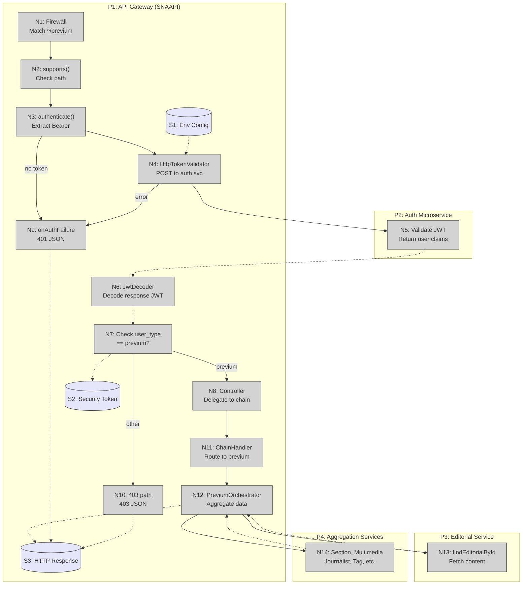

# Breadboard: previum-editorial-preview

## Places

| # | Place | Description |
|---|-------|-------------|
| P1 | API Gateway (SNAAPI) | Symfony HTTP entry point — controller, firewall, authenticator |
| P2 | Auth Microservice | External service that validates JWTs and returns user claims |
| P3 | Editorial Microservice | External service providing editorial content (ec/editorial-client) |
| P4 | Aggregation Services | External services: section, multimedia, journalist, tag, membership, widget |

---

## Code Affordances

| # | Place | Component | Affordance | Control | Wires Out | Returns To |
|---|-------|-----------|-----------|---------|-----------|-----------|
| N1 | P1 | Symfony Firewall | Match route `^/previum` → trigger authenticator | Guard | N2 | |
| N2 | P1 | PreviumJwtAuthenticator::supports() | Check if request has `/previum` path | Method | N3 | |
| N3 | P1 | PreviumJwtAuthenticator::authenticate() | Extract Bearer token from Authorization header | Method | N4 | N9 (on failure) |
| N4 | P1 | HttpTokenValidator::validate() | POST client JWT to auth microservice | HTTP call | N5 | N9 (on failure) |
| N5 | P2 | Auth Microservice | Validate JWT and return response JWT with user claims | External | | N6 |
| N6 | P1 | FirebaseJwtDecoder::decode() | Decode response JWT and extract payload | Method | | N7 |
| N7 | P1 | PreviumJwtAuthenticator (user_type check) | Verify `user_type === 'previum'` in payload | Method | N8 | N10 (on wrong type) |
| N8 | P1 | PreviumEditorialController::getPreviumEditorialById() | Delegate to OrchestratorChain with type `'previum'` | Method | N11 | S3 |
| N9 | P1 | PreviumJwtAuthenticator::onAuthenticationFailure() | Return 401 JSON response | Method | | S3 |
| N10 | P1 | PreviumJwtAuthenticator (403 path) | Return 403 JSON response | Method | | S3 |
| N11 | P1 | OrchestratorChainHandler::handler('previum') | Route to PreviumEditorialOrchestrator | Method | N12 | |
| N12 | P1 | PreviumEditorialOrchestrator::execute() | Fetch editorial WITHOUT isVisible() check | Method | N13, N14 | S3 |
| N13 | P3 | QueryEditorialClient::findEditorialById() | Fetch editorial content | HTTP call | | N12 |
| N14 | P4 | Aggregation clients (section, multimedia, etc.) | Fetch supplementary data in parallel | HTTP calls | | N12 |

---

## Data Stores

| # | Place | Store | Description |
|---|-------|-------|-------------|
| S1 | P1 | Environment Config | `PREVIUM_AUTH_HOST`, `PREVIUM_AUTH_ENDPOINT`, `PREVIUM_JWT_SECRET`, `PREVIUM_AUTH_TIMEOUT` |
| S2 | P1 | Symfony Security Token Storage | In-memory PreviumUser for current request (stateless) |
| S3 | P1 | HTTP Response | JsonResponse returned to client (editorial data, 401, 403, or 404) |

---

## Breadboard Diagram



---

## Wiring Summary

### Happy Path (authenticated previum user)
```
Request → N1 → N2 → N3 → N4 → [P2:N5] → N6 → N7(previum) → N8 → N11 → N12 → [P3:N13 + P4:N14] → S3(200 editorial)
```

### Error Paths
```
No token:     Request → N1 → N2 → N3 → N9 → S3(401)
Invalid JWT:  Request → N1 → N2 → N3 → N4 → [P2:N5 error] → N9 → S3(401)
Wrong type:   Request → N1 → N2 → N3 → N4 → [P2:N5] → N6 → N7(other) → N10 → S3(403)
Not found:    Request → N1 → N2 → N3 → N4 → [P2:N5] → N6 → N7(previum) → N8 → N11 → N12 → [P3:N13 404] → S3(404)
```

---

**Generated by**: workflows:shape > breadboarder (Phase 6)
**Date**: 2026-02-09
