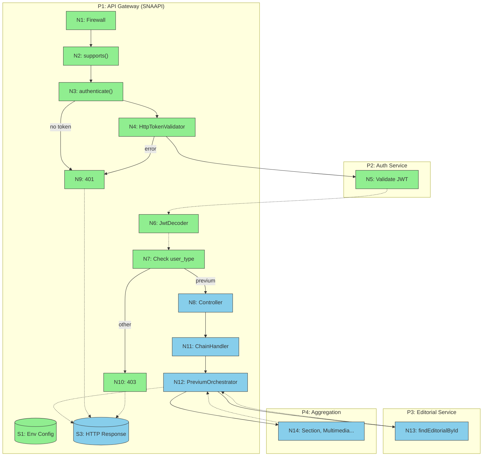

# Slices: previum-editorial-preview

## Summary

| Slice | Description | Affordances | Demo |
|-------|-------------|-------------|------|
| V1 | JWT extraction + validation pipeline | N1, N2, N3, N4, N5, N6, N7, N9, N10, S1 | Send request with/without JWT → get 401/403 responses |
| V2 | Previum editorial endpoint (unpublished content) | N8, N11, N12, N13, N14, S3 | Authenticated previum user sees unpublished editorial content |
| V3 | Firewall isolation + existing endpoint protection | N1 (firewall rules) | Verify `/editorials/{id}` still works without auth, `/previum/{id}` requires it |

---

## V1: JWT Authentication Pipeline

**Demo**: Send `GET /previum/123` with a valid JWT → microservicio validates → get through to controller. Send without token → get `401`. Send with wrong `user_type` → get `403`.

| # | Place | Affordance | Type |
|---|-------|-----------|------|
| N1 | P1 | Firewall match `^/previum` | Code |
| N2 | P1 | supports() — check path | Code |
| N3 | P1 | authenticate() — extract Bearer | Code |
| N4 | P1 | HttpTokenValidator — POST to auth svc | Code |
| N5 | P2 | Auth Microservice — validate JWT | External |
| N6 | P1 | JwtDecoder — decode response JWT | Code |
| N7 | P1 | Check user_type === previum | Code |
| N9 | P1 | onAuthFailure — 401 JSON | Code |
| N10 | P1 | 403 path — 403 JSON | Code |
| S1 | P1 | Environment Config | Store |
| S2 | P1 | Security Token Storage | Store |

### V1 Files

**New files**:
- `src/Previum/Authenticator/PreviumJwtAuthenticator.php`
- `src/Previum/Token/TokenValidatorInterface.php`
- `src/Previum/Token/HttpTokenValidator.php`
- `src/Previum/Token/JwtDecoderInterface.php`
- `src/Previum/Token/FirebaseJwtDecoder.php`
- `src/Previum/Model/PreviumUser.php`
- `src/Previum/Exception/InvalidTokenException.php`
- `src/Previum/Exception/InsufficientPermissionsException.php`
- `config/packages/previum_firewall.yaml`
- `config/packages/previum.yaml`
- Tests for all above

**Modified files**:
- `composer.json` (add symfony/security-bundle, firebase/php-jwt)
- `.env.dist` (add PREVIUM_* vars)
- `config/packages/httplug.yaml` (add previum_auth client)

---

## V2: Previum Editorial Endpoint

**Demo**: Authenticated previum user requests `GET /previum/456` where editorial 456 is unpublished → gets full editorial JSON data (same format as `/editorials/{id}`).

| # | Place | Affordance | Type |
|---|-------|-----------|------|
| N8 | P1 | Controller — delegate to chain | Code |
| N11 | P1 | ChainHandler — route to previum | Code |
| N12 | P1 | PreviumOrchestrator — aggregate data | Code |
| N13 | P3 | findEditorialById — fetch content | External |
| N14 | P4 | Aggregation clients (parallel) | External |
| S3 | P1 | HTTP Response (200 editorial data) | Store |

### V2 Files

**New files**:
- `src/Orchestrator/Chain/PreviumEditorialOrchestrator.php`
- `src/Controller/V1/PreviumEditorialController.php`
- Tests for both

**Modified files**:
- `config/routes/v1.yaml` (add previum route)
- `config/packages/orchestrators.yaml` (PreviumOrchestrator auto-registered via tag)

---

## V3: Firewall Isolation Verification

**Demo**: `GET /editorials/789` without any auth header → 200 OK (existing behavior preserved). `GET /previum/789` without auth → 401. Existing test suite passes without modification.

| # | Place | Affordance | Type |
|---|-------|-----------|------|
| N1 | P1 | Firewall (main: security false) | Code |

### V3 Files

**New files**:
- Integration test verifying both endpoints coexist

**Modified files**:
- None (verification only)

---

## Sliced Breadboard Diagram

**Legend**: Green = V1 (Auth pipeline), Blue = V2 (Editorial endpoint), Gold = V3 (Verification)

---

## Implementation Order

1. **V1 first** — Auth pipeline is the core risk. Build and validate independently.
2. **V2 second** — Connect authenticated request to editorial data. Depends on V1.
3. **V3 last** — Verification that V1+V2 don't break existing behavior.

---

**Generated by**: workflows:shape > breadboarder --slice (Phase 7)
**Date**: 2026-02-09
